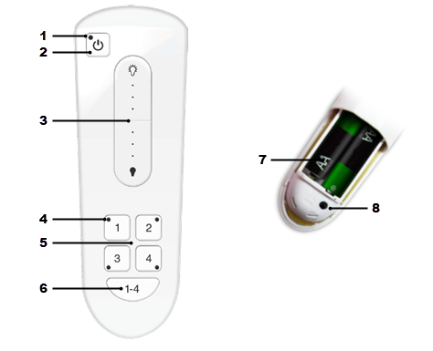

# Remote Control Components

The remote control of your [product-name] has components that allow you to program and operate the light bulbs on your lighting network.

| #   | Component                       | Description                                                                                                                                                                                                                                                                                                                                                                                                |
| --- | ------------------------------- | ---------------------------------------------------------------------------------------------------------------------------------------------------------------------------------------------------------------------------------------------------------------------------------------------------------------------------------------------------------------------------------------------------------- |
| 1   | Power button indicator          | Indicator that lights or flashes during different activities with the remote control. Indicators include: Green (Power on/off or dimmer command was successfully sent to the selected lighting group), Red (Power on/off or dimmer command failed. Indicator remains red for 3 seconds), and Amber (Batteries are running low. Indicator flashes amber periodically).                                      |
| 2   | Power button                    | Button that you press to turn on or off the lights in the selected lighting group(s). Lights turn on to the previous dimming level. **Note:** To turn on/off all network lights, regardless of lighting group, press and hold the power button for 3 seconds without first pressing the lighting group number button.                                                                                      |
| 3   | Dimmer control                  | Control that you press and hold to dim or brighten the lights in the selected lighting group(s). You do not have to press the power button first.                                                                                                                                                                                                                                                          |
| 4   | Lighting group number indicator | Indicator that lights or flashes during different activities with the corresponding lighting group. Indicators include: Green (Selected lighting group is activated for you to turn on/off, dim, or program. The lighting group remains activated for 5 seconds if you take no subsequent action), and Red (Lighting group was not activated for you to take action. Indicator remains red for 3 seconds). |
| 5   | Group number button             | Buttons that you press to select a corresponding lighting group to operate. Also use these buttons to program lights into the lighting group. **Caution:** Do not press and hold for longer than 4 seconds unless you are programming a lighting group.                                                                                                                                                    |
| 6   | All group numbers               | Button that you press to select all lighting groups to operate at the same time.                                                                                                                                                                                                                                                                                                                           |
| 7   | Battery compartment             | Compartment on the back that holds 2 AA batteries to power the remote control. When batteries run low, the indicator light on the power button periodically flashes amber.                                                                                                                                                                                                                                 |
| 8   | Reset button                    | Button that you press to manage the remote control as follows: Press and release 3 times to connect the remote control to a lighting network that already exists (for example, if you are replacing a remote control). Press and hold for 10 seconds to reset the remote control and all lighting group programming on it.[^1]                                                                             |

[^1]: If you reset the remote control, you must reprogram all lighting groups on it.
