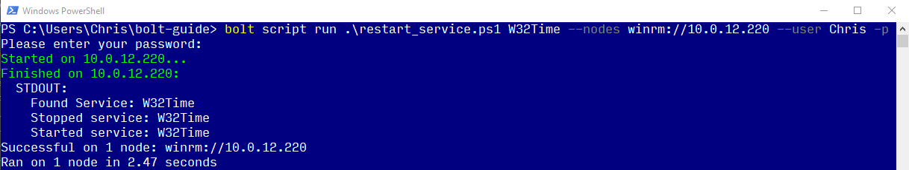
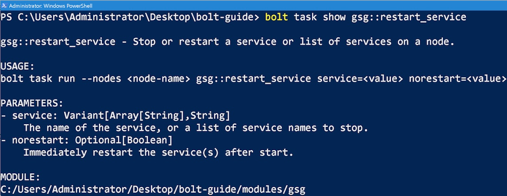
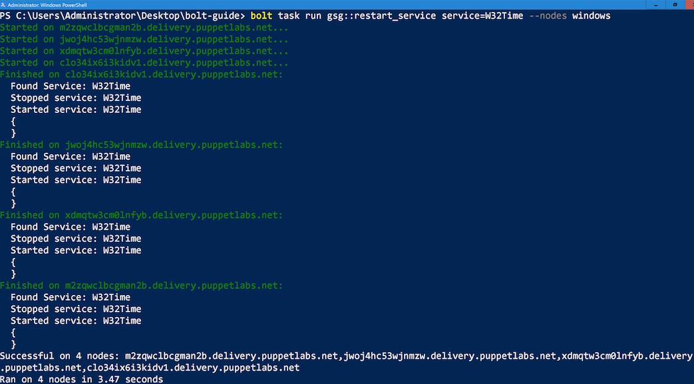

# Automating Windows targets

Bolt lets you automate almost any task you can think of. These are some of the
common scenarios we've come across.

If you'd like to share a real-world use case, reach out to us in the #bolt
channel on [Slack](https://slack.puppet.com).

For more usage examples, check out the [Puppet
blog](https://puppet.com/search/?query=bolt&page=1&configure%5BhitsPerPage%5D=20&refinementList%5Btype%5D%5B0%5D=Post).

## Run a PowerShell script that restarts a service

To show you how you can use Bolt to reuse your existing PowerShell scripts, this
guide walks you through running a script with Bolt, and then converting the
script to a Bolt task and running that.

> **Before you begin**
>
> -   Ensure you’ve already [installed Bolt](bolt_installing.md#) on your
>     Windows machine.
> -   Identify a remote Windows target to work with.
> -   Ensure you have Windows credentials for the target.
> -   Ensure you have [configured Windows Remote
>     Management](https://docs.microsoft.com/en-us/windows/desktop/winrm/installation-and-configuration-for-windows-remote-management)
>     on the target.

The example script,
called [restart_service.ps1](https://gist.github.com/RandomNoun7/03dfb910e5d93fefaae6e6c2da625c44#file-restart_service-ps1),
performs common task of restarting a service on demand. The process involves
these steps:

1.  Run your PowerShell script on a Windows target.
1.  Create an inventory file to store information about the target.
1.  Convert your script to a task.
1.  Execute your new task.


### 1. Run your PowerShell script on a Windows target

First, we’ll use Bolt to run the script as-is on a single target.

1.  Create a Bolt project directory to work in, called `bolt-guide`.
1.  Copy the
    [`restart_service.ps1`](https://gist.github.com/RandomNoun7/03dfb910e5d93fefaae6e6c2da625c44#file-restart_service-ps1)
    script into `bolt-guide`.
1.  In the `bolt-guide` directory, run the `restart_service.ps1` script:
    ```
    bolt script run .\restart_service.ps1 W32Time --targets winrm://<HOSTNAME> -u Administrator -p 
    ```

    

    **Note:** The `-p` option prompts you to enter a password.

    By running this command, you’ve brought your script under Bolt control and
    have run it on a remote target. When you ran your script with Bolt, the
    script was transferred into a temporary directory on the remote target, it
    ran on that target, and then it was deleted from the target.


### 2. Create an inventory file to store information about your targets

To run Bolt commands against multiple targets at once, you need to provide
information about the environment by creating an [inventory
file](inventory_file_v2.md). The inventory file is a YAML file that contains a
list of targets and target specific data.

1.  Inside the `bolt-guide` directory, use a text editor to create an
    `inventory.yaml` file and a `bolt-project.yaml` file. The `inventory.yaml` file is where
    connection information is stored, while `bolt-project.yaml` tells Bolt that the directory is a project
    and that it should load the inventory file from the directory.
2.  Inside the new `inventory.yaml` file, add the following content, listing the
    fully qualified domain names of the targets you want to run the script on,
    and replacing the credentials in the `winrm` section with those appropriate
    for your target:
    ```yaml
    groups:
      - name: windows
        targets:
          - <ADD WINDOWS SERVERS' FQDN>
          - <example.mycompany.com>
        config:
          transport: winrm
          winrm:
            user: Administrator
            password: <ADD PASSWORD>
    ```

    **Note:** To have Bolt securely prompt for a password, use the
    `--password-prompt` flag without supplying any value. This prevents the
    password from appearing in a process listing or on the console.
    Alternatively you can use the [``prompt` plugin`](inventory_file_v2.md#) to
    set configuration values via a prompt.

    You now have an inventory file where you can store information about your
    targets.

    You can also configure a variety of options for Bolt in `bolt-project.yaml`. For more
    information about configuration see [Configuring Bolt](configuring_bolt.md). For more
    information about Bolt projects see [Bolt projects](projects.md)


### 3. Convert your script to a Bolt task

To convert the `restart_service.ps1` script to a task, giving you the ability to
reuse and share it, create a [task metadata](writing_tasks.md#) file. Task
metadata files describe task parameters, validate input, and control how the
task runner executes the task.

**Note:** This guide shows you how to convert the script to a task by manually
creating the `.ps1` file in a directory called `tasks`. Alternatively, you can
use Puppet Development Kit (PDK), to create a new task by using the [`pdk new
task`
command](https://puppet.com/docs/pdk/1.x/pdk_reference.html#pdk-new-task-command).
If you’re going to be creating a lot of tasks, using PDK is worth getting to
know. For more information, see the [PDK
documentation.](https://puppet.com/docs/pdk/1.x/pdk_overview.html)

1.  In the `bolt-guide` directory, create the following subdirectories:
    ```
    bolt-guide/
    └── modules
        └── gsg
            └── tasks
    ```
1.  Move the `restart_service.ps1` script into the `tasks` directory.
1.  In the `tasks` directory, use your text editor to create a task metadata
    file — named after the script, but with a `.json` extension, in this
    example, `restart_service.json`.
1.  Add the following content to the new task metadata file:

    ```json
    {
      "puppet_task_version": 1,
      "supports_noop": false,
      "description": "Stop or restart a service or list of services on a target.",
      "parameters": {
        "service": {
          "description": "The name of the service, or a list of service names to stop.",
          "type": "Variant[Array[String],String]"
        },
        "norestart": {
          "description": "Immediately restart the services after start.",
          "type": "Optional[Boolean]"
        }
      }
    }
    ```

1.  Save the task metadata file and navigate back to the `bolt-guide` directory.

    You now have two files in the `gsg` module’s `tasks` directory:
    `restart_service.ps1` and `restart_service.json` -- the script is officially
    converted to a Bolt task. Now that it’s converted, you no longer need to
    specify the file extension when you call it from a Bolt command.
1.  Validate that Bolt recognizes the script as a task:
    ```
    bolt task show gsg::restart_service
    ```

    

    Congratulations! You’ve successfully converted the `restart_service.ps1`
    script to a Bolt task.

1.  Execute your new task:
    ```
    bolt task run gsg::restart_service service=W32Time --targets windows
    ```

    

    **Note:** `--targets windows` refers to the name of the group of targets
    that you specified in your inventory file. For more information, see
    [Specify targets](running_bolt_commands.md#adding-options-to-bolt-commands).


## Deploy a package with Bolt and Chocolatey

You can use Bolt with Chocolatey to deploy a package on a Windows node by
writing a [Bolt plan](writing_plans.md) that installs Chocolatey and uses
Puppet's Chocolatey package provider to install a package. This is all done
using content from the [Puppet Forge](https://forge.puppet.com).

> **Before you begin**
>
>- Install [Bolt](https://puppet.com/docs/bolt/latest/bolt_installing.html) and
>  the [Puppet Development Kit
>  (PDK)](https://www.puppet.com/docs/pdk/1.x/pdk_install.html).
>- Ensure you have Powershell and Windows Remote Management (WinRM) access.

In this example, you:

- Build a project-specific configuration using a Bolt project directory and PDK.
- Download module content from the Puppet Forge.
- Write a Bolt plan to apply Puppet code and orchestrate the deployment of a
  package resource using the Chocolatey provider.

### 1. Build a project-specific configuration

Bolt runs in the context of a [Bolt project
directory](projects.md). This directory contains all of the
configuration, code, and data loaded by Bolt.

1. Create a module called `bolt_choco_example`

```
mkdir bolt_choco_example
```

1. Add a `bolt-project.yaml` file to the `puppet_choco_tap` directory:

```
New-Item -Type File -Path .\puppet_choco_tap\bolt-project.yaml
```

Adding a `bolt-project.yaml` file (even if it's empty),  makes the containing directory
a Bolt project directory when you run Bolt from it. This is where Bolt loads
code and configuration from.

1. Create an inventory file to store information about your targets. This is
   stored as `inventory.yaml` by default in the project directory. Add the
   following code: 

```
groups:
  - name: windows
    targets:
      - chocowin0.classroom.puppet.com
      - chocowin1.classroom.puppet.com
    config:
      transport: winrm
      winrm:
        user: Administrator
        password: <ADD PASSWORD>
```

1. To make sure that your inventory is configured correctly and that you can
   connect to all the targets, run the following command from inside the project
   directory: 

```
bolt command run 'echo hi' --targets windows
```

**Note:** The `--targets windows` argument refers to the target group defined in
the inventory file.

You should get the following output:

```
Started on x.x.x.x...
Started on localhost...
Finished on localhost:
  STDOUT:
    hi
Finished on 0.0.0.0:
  STDOUT:
    hi
Finished on 127.0.0.1:
  STDOUT:
    hi
Successful on 3 targets: 0.0.0.0:20022,localhost
Ran on 3 targets in 0.20 seconds
```

### 2. Download the Chocolatey module

Bolt uses a [Puppetfile](https://puppet.com/docs/pe/latest/puppetfile.html) to
install module content from the Forge. A `Puppetfile` is a formatted text file
that specifies the modules and data you want in each environment.

1. Create a file named `Puppetfile` in the project directory, with the modules
   needed for this example:

```     
mod 'puppetlabs-chocolatey', '4.1.0'
mod 'puppetlabs-stdlib', '4.13.1'
mod 'puppetlabs-powershell', '2.3.0'
mod 'puppetlabs-registry', '2.1.0'
 ```

Note that you can install modules from a number of different sources. For more
information, see the [Puppetfile
README](https://github.com/puppetlabs/r10k/blob/master/doc/puppetfile.mkd#examples).

1. From inside the project directory, install the required modules:

```
bolt puppetfile install
```

After it runs, you can see a `modules` directory inside the project directory,
containing the modules you specified in the `Puppetfile`.

### 3. Write a Bolt plan to apply Puppet code

Write a Bolt plan to orchestrate the deployment of a package resource using the
Chocolatey provider. Plans allow you to run more than one task with a single
command, compute values for the input to a task, process the results of tasks,
or make decisions based on the result of running a task.

1. Create a `site-modules` directory. This is where you will add local code and
   modules.

1. Inside the `site-modules` directory, create a new module called
   `puppet_choco_tap`.

   ```
   pdk new module puppet_choco_tap
   ```

1. Inside the `puppet_choco_tap` module, create a plans directory with a Bolt
   plan at `/plans/installer.pp`.

The folder tree should look like this:

```
bolt_choco_example
└── site-modules
    └── puppet_choco_tap
        └── plans
            └── installer.pp 
```

1. Create a plan called `puppet_choco_tap::installer` by copying the following
   code into the `installer.pp` file::

```
plan puppet_choco_tap::installer(
  TargetSpec $targets,
  String $package,
  Variant[Enum['absent', 'present'], String ] $ensure = 'present',
){
  apply_prep($targets)

  apply($targets){
    include chocolatey

    package { $package :
      ensure    => $ensure,
      provider  => 'chocolatey',
      }
    }
  }
}
```
Take note of the following features of the plan:

- It has three parameters: the list of targets to install the package on, a
  `package` string for the package name, and the `ensure` state of the package
  which allows for version, absent or present.
- It has the `apply_prep` function call, which is used to install modules needed
  by `apply` on targets as well as to gather facts about the targets.
- `include chocolatey` installs the Chocolatey package manager. The Chocolatey
  provider is also deployed as a library with the Puppet agent in `apply_prep`.
- The [package
  resource](https://puppet.com/docs/puppet/latest/types/package.html) ensures a
  package's state using the Chocolatey provider.

1. To verify that the `puppet_choco_tap::installer` plan is available, run the
   following command inside the `bolt_choco_example` directory:

```
bolt plan show
```

The output should look like:

```
facts
facts::info
puppet_choco_tap::installer
puppetdb_fact
```

1. Run the plan with the `bolt plan run` command: 

```
bolt plan run puppet_choco_tap::installer package=frogsay --targets=windows
```

The output looks like this:

```
Starting: plan puppet_choco_tap::installer
Starting: install puppet and gather facts on chocowin0.classroom.puppet.com, chocowin1.classroom.puppet.com
Finished: install puppet and gather facts with 0 failures in 22.11 sec
Starting: apply catalog on chocowin0.classroom.puppet.com, chocowin1.classroom.puppet.com
Finished: apply catalog with 0 failures in 18.77 sec
Starting: apply catalog on chocowin0.classroom.puppet.com, chocowin1.classroom.puppet.com
Finished: apply catalog with 0 failures in 33.74 sec
Finished: plan puppet_choco_tap::installer in 74.63 sec
```

1. To check that the installation worked, run the following `frogsay` command: 

```        
bolt command run 'frogsay ribbit' --targets=windows 
```

The result will vary on each server, and will look something like this:

```
Started on chocowin1.classroom.puppet.com...
Started on chocowin0.classroom.puppet.com...
Finished on chocowin0.classroom.puppet.com:
  STDOUT:
    
            DO NOT PAINT OVER FROG.
            /
      @..@
     (----)
    ( >__< )
    ^^ ~~ ^^
Finished on chocowin1.classroom.puppet.com:
  STDOUT:
    
            TO PREVENT THE RISK OF FIRE OR ELECTRIC SHOCK, DO NOT ENGAGE WITH FROG
            WHILE AUTOMATIC UPDATES ARE BEING INSTALLED.
            /
      @..@
     (----)
    ( >__< )
    ^^ ~~ ^^
Successful on 2 targets: chocowin0.classroom.puppet.com,chocowin1.classroom.puppet.com
Ran on 2 targets in 3.15 seconds
```

That’s it! In this one plan, you have both installed Chocolatey and deployed the
package to two targets. You can do the same thing on any number of targets by
editing the inventory file. Note that Chocolatey will remain installed on your
machine.

After you have installed your package, with the help of Bolt, you can use
Chocolatey to automate all of the package management tasks for upgrades or
uninstalls. You can use Puppet Enterprise to guarantee state across all of your
nodes and handle configuration drift — and make sure no one accidentally
uninstalls the package that you just installed.
