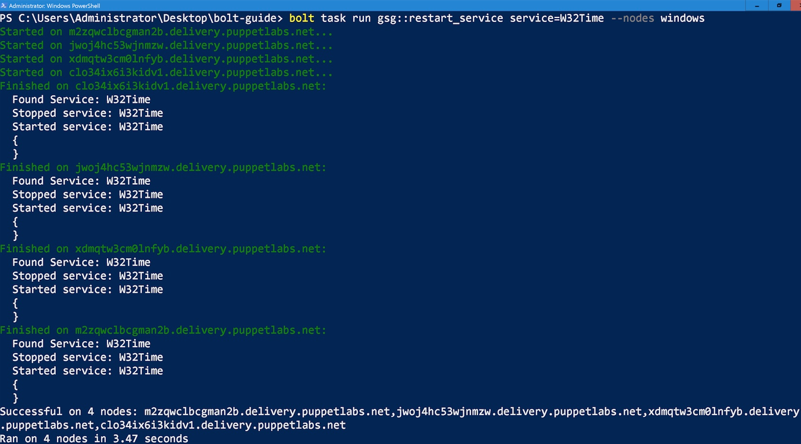

# Bolt examples

Bolt lets you automate almost any task you can think of. These are some of the common scenarios we've come across.

If you'd like to share a real-world use case, reach out to us in the \#bolt channel on [Slack](https://slack.puppet.com).

For more usage examples, check out the [Puppet blog](https://puppet.com/blog-tags/puppet-bolt).

## Run a PowerShell script that restarts a service

To show you how you can use Bolt to reuse your existing PowerShell scripts, this guide walks you through running a script with Bolt, and then converting the script to a Bolt task and running that.

**Before you begin**
-   Ensure you’ve already [installed Bolt](bolt_installing.md#) on your Windows machine.
-   Identify a remote Windows target node to work with.
-   Ensure you have Windows credentials for the target node.
-   Ensure you have [configured Windows Remote Management](https://docs.microsoft.com/en-us/windows/desktop/winrm/installation-and-configuration-for-windows-remote-management) on the target node.

The example script, called [restart_service.ps1](https://gist.github.com/RandomNoun7/03dfb910e5d93fefaae6e6c2da625c44#file-restart_service-ps1), performs common task of restarting a service on demand. The process involves these steps:

1.  Run your PowerShell script on a target Windows node.
1.  Create an inventory file to store information about the node.
1.  Convert your script to a task.
1.  Execute your new task.


### 1. Run your PowerShell script on a Windows target node

First, we’ll use Bolt to run the script as-is on a single target node.

1.  Create a Bolt project directory to work in, called `bolt-guide`.
1.  Copy the [`restart_service.ps1`](https://gist.github.com/RandomNoun7/03dfb910e5d93fefaae6e6c2da625c44#file-restart_service-ps1) script into `bolt-guide`.
1.  In the `bolt-guide` directory, run the `restart_service.ps1` script:
    ```
    bolt script run .\restart_service.ps1 W32Time --nodes winrm://<HOSTNAME> -u Administrator -p 
    ```

    

    **Note:** The `-p` option prompts you to enter a password.

    By running this command, you’ve brought your script under Bolt control and have run it on a remote node. When you ran your script with Bolt, the script was transferred into a temporary directory on the remote node, it ran on that node, and then it was deleted from the node.


### 2. Create an inventory file to store information about your nodes

To run Bolt commands against multiple nodes at once, you need to provide information about the environment by creating an [inventory file](inventory_file.md). The inventory file is a YAML file that contains a list of target nodes and node specific data.

1.  Inside the `bolt-guide` directory, use a text editor to create an `inventory.yaml` file.
1.  Inside the new `inventory.yaml` file, add the following content, listing the fully qualified domain names of the target nodes you want to run the script on, and replacing the credentials in the `winrm` section with those appropriate for your node:
    ```yaml
    groups:
      - name: windows
        nodes:
          - <ADD WINDOWS SERVERS' FQDN>
          - <example.mycompany.com>
        config:
          transport: winrm
          winrm:
            user: Administrator
            Password: <ADD PASSWORD>
    ```

    **Note:** To have Bolt securely prompt for a password, use the `--password` or `-p` flag without supplying any value. This prevents the password from appearing in a process listing or on the console. Alternatively you can use the [``prompt` plugin`](inventory_file_v2.md#) to set configuration values via a prompt.

    You now have an inventory file where you can store information about your nodes.

    You can also configure a variety of options for Bolt in `bolt.yaml`, including global and transport options. For more information, see [Bolt configuration options](bolt_configuration_options.md).


### 3. Convert your script to a Bolt task

To convert the `restart_service.ps1` script to a task, giving you the ability to reuse and share it, create a [task metadata](writing_tasks.md#) file. Task metadata files describe task parameters, validate input, and control how the task runner executes the task.

**Note:** This guide shows you how to convert the script to a task by manually creating the `.ps1` file in a directory called `tasks`. Alternatively, you can use Puppet Development Kit \(PDK\), to create a new task by using the [`pdk new task` command](https://puppet.com/docs/pdk/1.x/pdk_reference.html#pdk-new-task-command). If you’re going to be creating a lot of tasks, using PDK is worth getting to know. For more information, see the [PDK documentation.](https://puppet.com/docs/pdk/1.x/pdk_overview.html)

1.  In the `bolt-guide` directory, create the following subdirectories:
    ```
    bolt-guide/
    └── modules
        └── gsg
            └── tasks
    ```
1.  Move the `restart_service.ps1` script into the `tasks` directory.
1.  In the `tasks` directory, use your text editor to create a task metadata file — named after the script, but with a `.json` extension, in this example, `restart_service.json`.
1.  Add the following content to the new task metadata file:

    ```json
    {
      "puppet_task_version": 1,
      "supports_noop": false,
      "description": "Stop or restart a service or list of services on a node.",
      "parameters": {
        "service": {
          "description": "The name of the service, or a list of service names to stop.",
          "type": "Variant[Array[String],String]"
        },
        "norestart": {
          "description": "Immediately restart the services after start.",
          "type": "Optional[Boolean]"
        }
      }
    }
    ```

1.  Save the task metadata file and navigate back to the `bolt-guide` directory.

    You now have two files in the `gsg` module’s `tasks` directory: `restart_service.ps1` and `restart_service.json` -- the script is officially converted to a Bolt task. Now that it’s converted, you no longer need to specify the file extension when you call it from a Bolt command.
1.  Validate that Bolt recognizes the script as a task:
    ```
    bolt task show gsg::restart_service
    ```

    

    Congratulations! You’ve successfully converted the `restart_service.ps1` script to a Bolt task.

1.  Execute your new task:
    ```
    bolt task run gsg::restart_service service=W32Time --nodes windows
    ```

    

    **Note:** `--nodes windows` refers to the name of the group of target nodes that you specified in your inventory file. For more information, see [Specify target nodes](bolt_options.md#).
